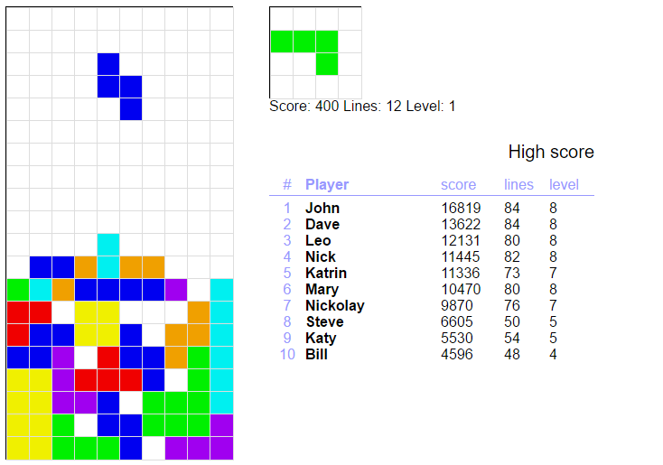

# FastTet is a classic tetris on JavaScript with jQuery
###Features
* Classic game type 
* Canvas element for drawings
* Next figure preview window
* High score table supplied by <a href="https://openws-app.herokuapp.com/#/">OpenWS</a>
* Single file app
* Pause on focus loss

# <a href="http://htmlpreview.github.io/?https://github.com/Zak-r2/fasttet/blob/master/tetris.html">Play ►</a> right now

